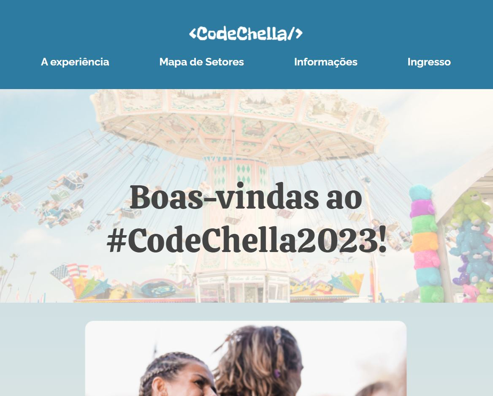

# Nome do meu projeto

Rápida descrição do objetivo de fazer esse projeto

| :placard: Vitrine.Dev |     |
| -------------  | --- |
| :sparkles: Nome        | **CodeChella2023**
| :label: Tecnologias | javascript, html, react+vite, react-router-dom, styled-components, sass
| :rocket: URL         | https://code-chella2023-nstu9l2j9-marianaceci.vercel.app/
| :fire: Desafio     | https://cursos.alura.com.br/codechella-semana-1-monicahillman-1673444925008-p514254

<!-- Inserir imagem com a #vitrinedev ao final do link -->

## Detalhes do projeto

Textos e imagens que descrevam seu projeto, suas conquistas, seus desafios, próximos passos, etc...

*************************************************
- fazer data folder
- arrumar LINEUP
- ajustar .json do lineup
- add trocar theme
- fazer pagina Not Found
*************************************************

FAZER COM TYPESCRIPT
FAZER COM DATABASE

React + Vite
styled components + SASS
npm i react-router-dom

https://github.com/szhsin/react-accordion
An unstyled, accessible accordion library for React apps and design systems
npm install @szhsin/react-accordion